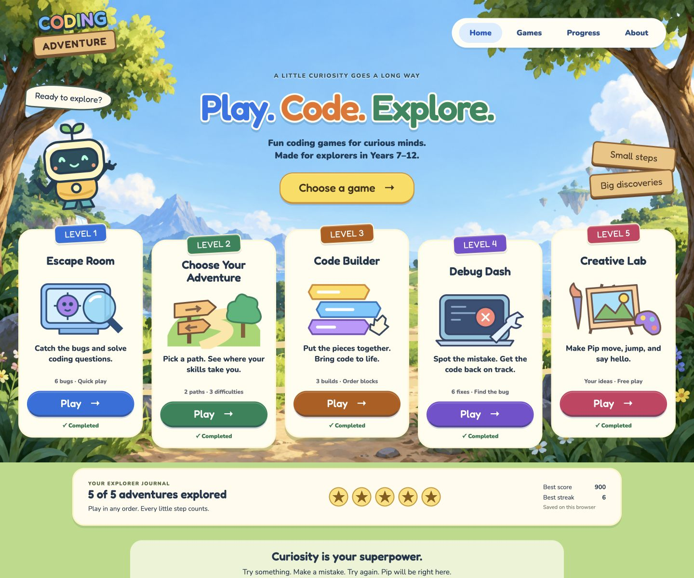

# Coding Adventure

A browser-based coding game where students learn programming concepts through interactive challenges. Built for Years 7–12 and beginner programmers.



## Play

A live deployment has not been created yet. Run locally below, or follow the [Vercel guide](docs/HANDOFF.md#vercel-deployment-after-approval).

## Game Modes

### Escape Room

Catch six moving bugs and solve coding questions to restore Bug Forest.

### Choose Your Adventure

Choose Front-End or Back-End, select a difficulty, and solve five scenario-based challenges for a student club website.

### Code Builder

Arrange code blocks with dragging or keyboard controls across three increasingly challenging builds.

### Debug Dash

Find and fix six mistakes in short code snippets, with explanations and unlimited retries.

### Creative Lab

Choose a world and character, then assemble and repeat a safe plan of movement, speech, and color actions.

## Features

- 72 quiz questions with explanations: 12 general, 48 Adventure, and 12 debugging questions
- 9 Code Builder puzzles, sampled across three difficulties
- Creative Lab with 6 predefined actions, up to 8 steps, and 1–4 repetitions
- Five unlocked games, illustrated scenery, original mascot Pip, and local completion badges
- Randomized questions and answer order, with no repeated question within a run
- Beginner, Intermediate, and Advanced Adventure difficulties
- 100 points per solved question, plus 50 on the first try; streaks count consecutive first-try answers
- Unlimited retries, progress displays, completion screens, restart, and replay
- Separate personal bests for Escape Room, each Adventure combination, Code Builder, and Debug Dash
- Browser-local best scores, best streaks, and selected Adventure preferences
- Responsive targets, keyboard controls, visible focus, a focus-contained dialog, and reduced-motion support
- Safe recovery when storage is unavailable or question data is missing

## Tech

HTML, CSS, vanilla JavaScript ES modules, and localStorage. Prepared for static hosting on Vercel. No application dependencies, accounts, backend, database, environment variables, or production build step.

Node.js is used only for the optional developer checks.

## Run Locally

From this repository’s root:

```sh
python3 -m http.server 4173 --bind 127.0.0.1
```

Open [localhost:4173](http://localhost:4173). Use an HTTP server rather than opening the HTML file directly, because the app uses ES modules.

With Node.js 20.11 or newer:

```sh
npm test
npm run check
```

No `npm install` is needed. See [test results and manual coverage](docs/TESTING.md).

## Screenshots

[Home](docs/screenshots/home.png) · [Escape Room](docs/screenshots/escape-room.png) · [Adventure](docs/screenshots/adventure.png) · [Code Builder](docs/screenshots/code-builder.png) · [Debug Dash](docs/screenshots/debug-dash.png) · [Creative Lab](docs/screenshots/creative-lab.png)

Artwork and bundled font provenance are documented in [assets/README.md](assets/README.md). Creative Lab interprets a fixed command list; it does not execute arbitrary JavaScript. No audio is included.

## Project Origin

This project originated as a collaborative hackathon project.

Original repository: [Milktea0408/Hackathon](https://github.com/Milktea0408/Hackathon)

This personal continuation contains additional improvements and maintenance by Ellis Mon, developed with AI coding assistance. The original two-mode concept and collaborative prototype predate this continuation. The upgrade completes Adventure, replaces the question bank, adds three playable modes, refactors state and rendering, and adds an illustrated interface, scoring, persistence, accessibility, and tests. These improvements do not imply sole authorship of the original project.

Original history is preserved through commit `c3750cd`. See [the contribution record](CONTRIBUTIONS.md) for the boundary between shared work and this continuation. No new license is asserted over the original team’s work.

## Contributors

The original Git history records these author identities (listed without assuming whether multiple identities belong to the same person):

- Ellis Mon
- eppm27
- Milktea0408

The original repository and full commit history remain the source of truth for individual contributions. No original feature is attributed to a particular person here without supporting documentation.
